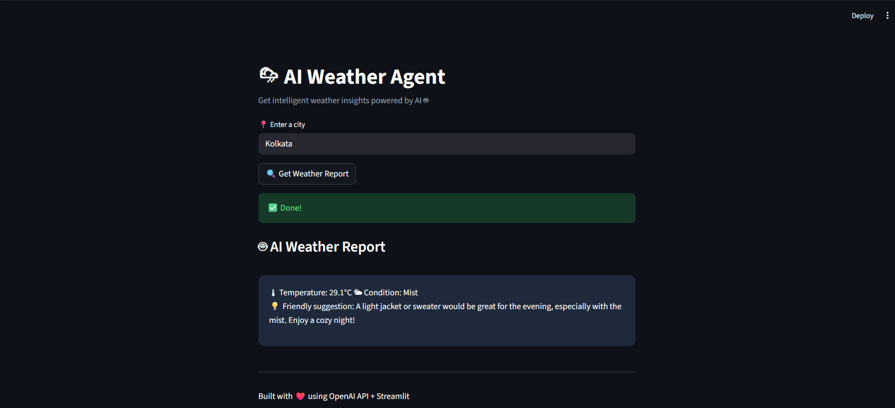

# 🌦 AI Weather Agent

An AI-powered weather assistant that fetches real-time weather data and uses OpenAI to generate intelligent insights.

---

## 🚀 Features
- 🌦 Fetch real-time weather data
- 🧠 AI-powered analysis using GPT-4o mini
- 💡 Smart suggestions based on weather
- 🌐 Interactive web app using Streamlit

---

## 🛠 Tech Stack
- Python
- OpenAI API
- Weather API
- Streamlit

---

## 📸 Demo



---

## ▶️ How to Run

```bash
pip install -r requirements.txt
streamlit run app.py
